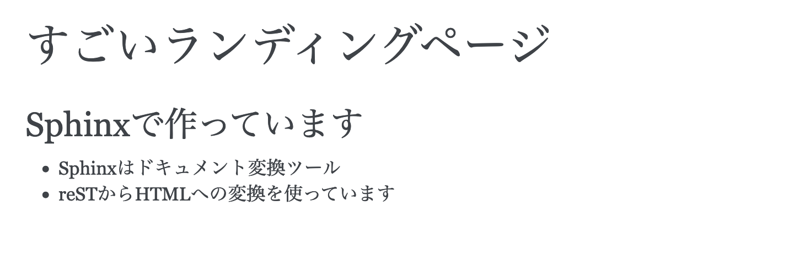
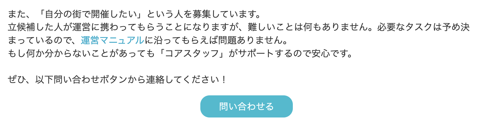
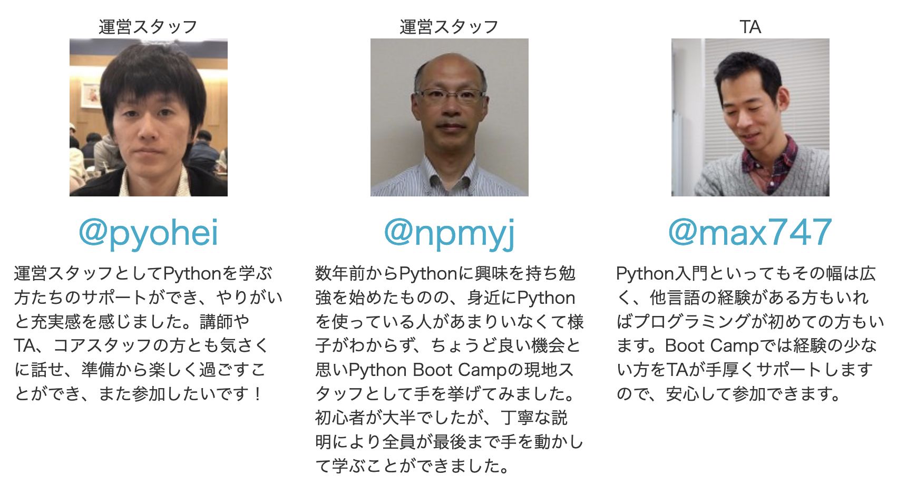
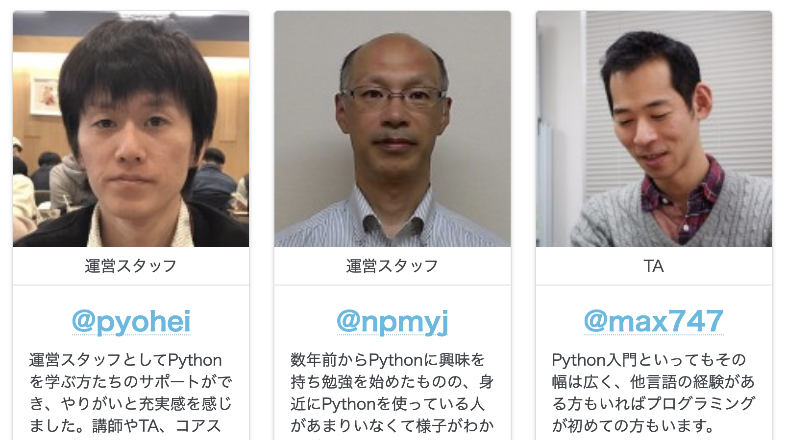
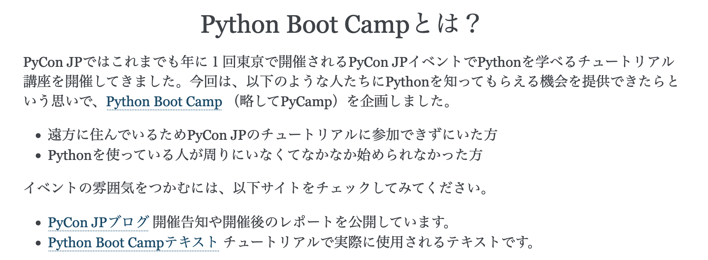
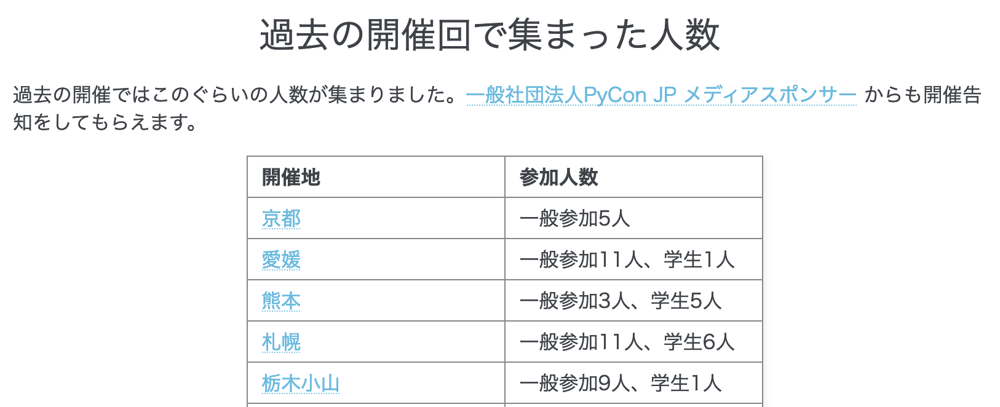

================================================================================
Sphinxで作るランディングページ
================================================================================

:Event: PyLadies Tokyo - 8周年記念オンラインパーティ
:Presented: 2022/11/19 nikkie

8周年、おめでとうございます！🎂🎂🎂🎂🎂🎂🎂🎂
================================================================================

お祝い8つ持参しました（1️⃣〜8️⃣）

お前、誰よ
============================================================

* **Python** 大好き、にっきー（`アスタリスク好き <https://2022.pycon.jp/timetable?id=LPYF7C>`_）
* :fab:`twitter` `@ftnext <https://twitter.com/ftnext>`_ ／ :fab:`github` `@ftnext <https://github.com/ftnext>`_ ／ `はてなブログ <https://nikkie-ftnext.hatenablog.com/>`_
* 株式会社ユーザベースでデータサイエンティスト（自然言語処理、XP）
* 2018年 **4周年記念以来** の参加（`Django Girls Tutorial翻訳のLT <https://github.com/ftnext/2018_LTslides/blob/master/pyladies_Oct_Django_Girls/PITCHME.md>`_）

本編：この話をします
================================================================================

.. raw:: html

    <blockquote class="twitter-tweet" data-align="center" data-dnt="true">
<a href="https://twitter.com/hashtag/pyconjp?src=hash&amp;ref_src=twsrc%5Etfw">#pyconjp</a> Python Boot Campのページ（静的なHTML）は 実は今年にっきーがSphinxに移行しました✌️（GitHub Pagesでサーブ）<a href="https://t.co/0QTfwXGxBh">https://t.co/0QTfwXGxBh</a>  📣なんとSphinxでLPが作れちゃうんです！
&mdash; nikkie にっきー 🎤10/1 XP祭り 10/14-15 PyCon JP (@ftnext) <a href="https://twitter.com/ftnext/status/1581201590957924353?ref_src=twsrc%5Etfw">October 15, 2022</a></blockquote> 

お手元で触りながら聞くのがオススメです
--------------------------------------------------

https://pycamp-lp.pycon.jp/

Python Boot Camp (#pycamp)
================================================================================

* *日本各地での初心者向けPythonチュートリアルイベント*
* 詳しくは https://www.pycon.jp/support/bootcamp.html
* 概要を伝える **ランディングページ** がある

pycampのランディングページについて相談
--------------------------------------------------

    ペライチの仕様が3月28日から変更になり、無料プランは累計10,000PVを超えると有料プランへの切り替えが必要になった（切り替えないとページが強制的に非公開になる）。

2022/03 `一般社団法人PyCon JP Association運営会議#52 <https://www.pycon.jp/committee/meeting/minutes52.html#pycamp-ryu22e>`_

手を挙げたnikkie氏🙋‍♂️「まかせて！」
--------------------------------------------------

    Sphinxを使ってGitHub Pagesに移すなら、個人的な型があるので、私はやってみたいです (nikkie

.. _Sphinxをはじめよう 第3版: https://www.oreilly.co.jp/books/9784873119830/

ドキュメント変換ツール Sphinx
================================================================================

    あるルールに従って記述されたテキストファイルを、HTMLやPDFなどの形式に変換する

📖『`Sphinxをはじめよう 第3版`_』（1章）

reSTで書いたテキストファイル
--------------------------------------------------

* 「あるルール」の例：reST (reStructuredText)
* reSTはマークアップ言語で、テキストのままでも読みやすい（『`Sphinxをはじめよう 第3版`_』1.2）

.. code-block:: rest

    ========================================
    すごいランディングページ
    ========================================

    Sphinxで作っています
    ========================================

    * Sphinxはドキュメント変換ツール
    * reSTからHTMLへの変換を使っています

reSTをHTMLに変換
--------------------------------------------------

.. code-block:: shell

    $ make html

ブラウザでHTMLを開く

HTMLをWebに公開
--------------------------------------------------

* reSTから変換したHTMLは、静的サイトホスティングサービスを使ってWebに公開できる
* 今回のランディングページの例では **GitHub Pages** を使用
* GitHub Pages用のブランチにHTML一式をpushする

ランディングページのこの要素、Sphinxでもできるんですか？
================================================================================

ランディングページにはあるけど、ドキュメントではあまり見かけないモノたち

ボタン
--------------------------------------------------

カードの並び
--------------------------------------------------

``sphinx_design`` も使ってできます！
================================================================================

:fab:`github` https://github.com/executablebooks/sphinx-design

1️⃣🎂ボタンできます！
--------------------------------------------------

.. code-block:: rest

    .. button-link:: https://docs.google.com/forms/d/1IANh21fievi_lyyQyL8II66RSxlVuHBdAhr05C1qv9c/viewform
        :align: center
        :class: sd-rounded-pill sd-px-4

        問い合わせる

https://sphinx-design.readthedocs.io/en/furo-theme/badges_buttons.html#buttons

2️⃣🎂カードの並びもできます！
--------------------------------------------------

.. code-block:: rest

    .. grid:: 1 1 2 3

        .. grid-item-card:: `@pyohei <https://github.com/pyohei>`_
            :img-top: _static/impressions/pyohei.jpg
            :class-header: sd-text-center
            :class-title: sd-text-center sd-fs-3

            運営スタッフ
            ^^^
            運営スタッフとしてPythonを学ぶ方たちのサポートができ、やりがいと充実感を感じました。

https://sphinx-design.readthedocs.io/en/furo-theme/grids.html#placing-a-card-in-a-grid

.. revealjs-break::

Sphinxのデフォルトテーマ Alabaster、存在感ある
================================================================================

3️⃣🎂Alabasterは **簡単にスタイル変更** できます！
--------------------------------------------------

.. code-block:: python
    :caption: conf.py
    :emphasize-lines: 2-6

    html_theme = 'alabaster'
    html_theme_options = {
        "font_family": "sans-serif",
        "font_size": "16px",
        "link": "#4EBBE2",
    }

https://alabaster.readthedocs.io/en/latest/customization.html#fonts

Alabasterと言われても気づかないのでは？
--------------------------------------------------

.. figure:: ../_static/pyladies_tokyo_anniversary/202211_set_options_alabaster.png

細かいところに **自作Sphinx拡張**
================================================================================

4️⃣〜6️⃣🎂

h1, h2の中央寄せ
================================================================================

.. figure:: ../_static/pyladies_tokyo_anniversary/202211_centering_h1_h2.png

4️⃣🎂拡張を自作（リポジトリ内にモジュールとして配置）
------------------------------------------------------------

* Sphinxのイベントの1つ ``doctree-resolved`` （`ドキュメント <https://www.sphinx-doc.org/ja/master/extdev/appapi.html#event-doctree-resolved>`_）

  * 入力したテキストファイルを **木** 構造(doctree)に変えたとき

* 木をたどって、HTMLでh1, h2にあたる要素に ``sd-text-center`` クラスを付与

  * sphinx-designが提供する **中央揃え** のクラス

容易に更新できる、参加人数の表
================================================================================

要件：容易に表に行追加できる
--------------------------------------------------

* 時間とともにpycampの **開催数は増える** （`connpassのイベント一覧 <https://pyconjp.connpass.com/event/>`_）
* 実装に精通していなくても、参加人数の表を **更新** できるよう容易にするべきと考えた

  * nikkieに毎回更新を頼む形は避けたい

現状： **CSVファイルに列の追加だけ** していただく
--------------------------------------------------

.. code-block:: csv
    :caption: participants_count.csv

    開催地,URL,参加人数
    静岡県沼津市,https://pyconjp.connpass.com/event/251468/,一般参加8人、学生3人
    新潟2nd,https://pyconjp.connpass.com/event/255600/,一般参加10人、学生5人

`GitHubリポジトリに記載した手順 <https://github.com/pyconjp/pycamp.landing_page#%E9%81%8E%E5%8E%BB%E3%81%AE%E9%96%8B%E5%82%AC%E5%9B%9E%E3%81%A7%E9%9B%86%E3%81%BE%E3%81%A3%E3%81%9F%E4%BA%BA%E6%95%B0%E3%81%AE%E8%BF%BD%E5%8A%A0%E6%96%B9%E6%B3%95>`_

5️⃣🎂CSVファイルを元に人数表を作るディレクティブを自作
------------------------------------------------------------

.. code-block:: python

    class EventHistoryCSVTable(CSVTable):
        ...

    def setup(app):
        app.add_directive("event-history-csv-table", EventHistoryCSVTable)

* **開催地にリンクのマークアップ** をした上で、参加人数と合わせて ``CSVTable`` に渡す実装（`CSVテーブルディレクティブ <https://sphinx-users.jp/gettingstarted/directives.html#csv>`_）
* CSVファイルに「開催地,URL,参加人数」だけ追加しさえすれば、後はコードが責務を果たす

外部へのリンクをブラウザの新しいタブで開く
================================================================================

（少なくとも私は）ランディングページの説明とそこからのリンクを **タブを切り替えて行き来** したい

.. _sphinx-new-tab-link: https://pypi.org/project/sphinx-new-tab-link/

6️⃣🎂自作拡張 `sphinx-new-tab-link`_ （公開済み）
------------------------------------------------------------

.. code-block:: shell

    pip install sphinx-new-tab-link

.. code-block:: python
    :caption: conf.py

    extensions = [
        "sphinx_new_tab_link",
    ]

詳しくは `SphinxでビルドしたHTMLの中の外部リンクを、ブラウザの新しいタブで開くように設定する拡張 sphinx-new-tab-link を公開しました！🎉 <https://nikkie-ftnext.hatenablog.com/entry/release-sphinx-new-tab-link-v0.1.0>`_

紹介しきれなかったもの（8つ紹介するのに5分はあまりにも短い）
================================================================================

* 7️⃣🎂 ``sphinx.ext.githubpages`` がGitHub Pagesでの公開をサポート（`こちらのブログ <https://nikkie-ftnext.hatenablog.com/entry/do-you-know-sphinx-ext-githubpages>`_）
* 8️⃣🎂 ``make singlehtml`` 使ってます！

Sphinxで作るランディングページ やってみての感想
================================================================================

* **技術的に少し挑戦** しつつコミュニティに **貢献** という今回のやり方はとても楽しかった🤟
* 拡張が作れるようになるとSphinxは自在に使えるし、他の拡張の凄さも伺い知れる（Alabasterすごい！）
* アスタリスク（星印）が好きなので、GitHubでスター🌟ください！(笑)

まとめ🌯 Sphinxで作るランディングページ
================================================================================

* https://pycamp-lp.pycon.jp/ はSphinxとGitHub Pagesでできています
* ランディングページに必要な要素（ボタンやカード）は **sphinx_design** で
* **Sphinx拡張を自作** して、ランディングページの細かい要素を実現

ご清聴ありがとうございました！
--------------------------------------------------

* 地方でPythonイベントを開催してみたい方、pycampいかがですか？（`コアスタッフの方のブログ <https://ryu22e.org/posts/2022/11/12/djangocongressjp2022/#%E6%9C%80%E5%BE%8C%E3%81%AB>`_）
* 参考にランディングページ作りたい方、困ったらお気軽に `@ftnext <https://twitter.com/ftnext>`_ をお呼びください！

EOF
==============================
