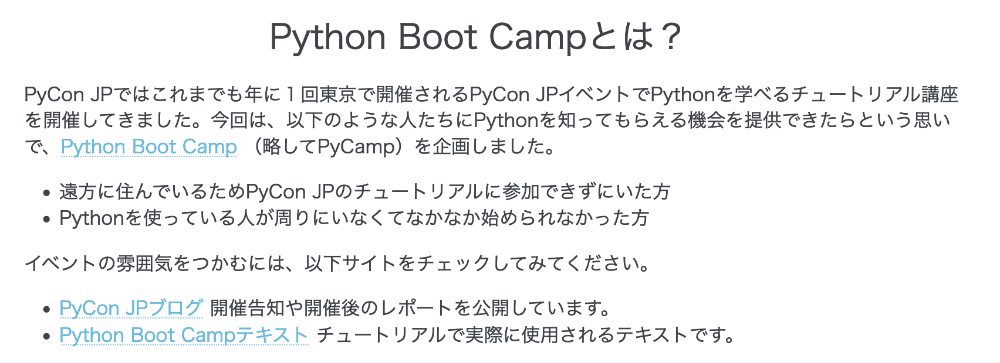

================================================================================
Sphinxで作るランディングページ
================================================================================

:Event: PyLadies Tokyo - 8周年記念オンラインパーティ
:Presented: 2022/11/19 nikkie

8周年、おめでとうございます！🎂🎂🎂🎂🎂🎂🎂🎂
================================================================================

本編：この話をします
================================================================================

.. raw:: html

    <blockquote class="twitter-tweet">
<a href="https://twitter.com/hashtag/pyconjp?src=hash&amp;ref_src=twsrc%5Etfw">#pyconjp</a> Python Boot Campのページ（静的なHTML）㯠実ã¯ä»Šå¹´ã«ã£ãーãŒSphinxに移行しました✌️（GitHub Pagesでサーブ）<a href="https://t.co/0QTfwXGxBh">https://t.co/0QTfwXGxBh</a>  📣なんとSphinxでLPが作れちゃうんです！
&mdash; nikkie にっきー 🎤10/1 XP祭り 10/14-15 PyCon JP (@ftnext) <a href="https://twitter.com/ftnext/status/1581201590957924353?ref_src=twsrc%5Etfw">October 15, 2022</a></blockquote> 

Python Boot Camp (#pycamp)
================================================================================

* *日本各地での初心者向けPythonチュートリアルイベント*
* 詳しくは https://www.pycon.jp/support/bootcamp.html
* 概要を伝える **ランディングページ** がある

pycampのランディングページについての議論
--------------------------------------------------

    ペライチの仕様が3月28日から変更になり、無料プランは累計10,000PVを超えると有料プランへの切り替えが必要になった（切り替えないとページが強制的に非公開になる）。

2022/03 `一般社団法人PyCon JP Association運営会議#52 <https://www.pycon.jp/committee/meeting/minutes52.html#pycamp-ryu22e>`_ で相談

手を挙げたnikkie氏🙋‍♂️「まかせて！」
--------------------------------------------------

    Sphinxを使ってGitHub Pagesに移すなら、個人的な型があるので、私はやってみたいです (nikkie

ドキュメンテーションツール Sphinx
================================================================================

TODO 補足

* reST (reStructuredText) を書く
* HTMLをビルド
* 作ったHTMLをGitHub Pagesでホスティングする（＝Webに公開）

ランディングページのこの要素、Sphinxでもできるんですか？
================================================================================

ボタン
--------------------------------------------------

カードの並び
--------------------------------------------------

.. figure:: ../_static/pyladies_tokyo_anniversary/202211_cards_peraichi_ver.png

``sphinx_design`` も使ってできます！
================================================================================

https://github.com/executablebooks/sphinx-design

ボタンできます！
--------------------------------------------------

.. code-block:: rest

    .. button-link:: https://docs.google.com/forms/d/1IANh21fievi_lyyQyL8II66RSxlVuHBdAhr05C1qv9c/viewform
        :align: center
        :class: sd-rounded-pill sd-px-4

        問い合わせる

.. figure:: ../_static/pyladies_tokyo_anniversary/202211_button_sphinx_ver.png

カードの並びもできます！
--------------------------------------------------

.. code-block:: rest

    .. grid:: 1 1 2 3

        .. grid-item-card:: `@pyohei <https://github.com/pyohei>`_
            :img-top: _static/impressions/pyohei.jpg
            :class-header: sd-text-center
            :class-title: sd-text-center sd-fs-3

            運営スタッフ
            ^^^
            運営スタッフとしてPythonを学ぶ方たちのサポートができ、やりがいと充実感を感じました。

.. revealjs-break::

.. figure:: ../_static/pyladies_tokyo_anniversary/202211_cards_sphinx_ver.png

Sphinxのデフォルトテーマ Alabaster
================================================================================

.. figure:: ../_static/pyladies_tokyo_anniversary/202211_default_alabaster.png

Alabasterは **簡単にスタイル変更** できます！
--------------------------------------------------

.. code-block:: python
    :caption: conf.py
    :emphasize-lines: 2-6

    html_theme = 'alabaster'
    html_theme_options = {
        "font_family": "sans-serif",
        "font_size": "16px",
        "link": "#4EBBE2",
    }

Alabasterと言われても気づかないのでは？
--------------------------------------------------

細かいところに **自作Sphinx拡張**
================================================================================

h1, h2の中央寄せ
================================================================================

誰でも更新できる、参加人数の表
================================================================================

外部へのリンクをブラウザの別のタブで開く
================================================================================
