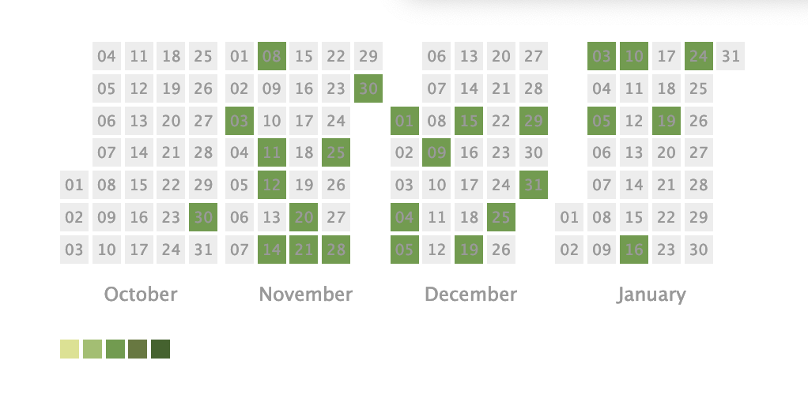

========================================
PyCon Kyushu 2022 Kumamoto レポート
========================================

:Event: みんなのPython勉強会 #77 LT
:Presented: 2022/01/27 nikkie

お前、誰よ
========================================

* nikkie（にっきー）
* Python歴4年（いまPythonの見た目が面白い！）
* みんなのPython勉強会 4代目LT王子、スタッフ
* PyCon JP 2021座長

最近のnikkie
--------------------------------------------------

映画『`アイの歌声を聴かせて <https://ainouta.jp/>`_』🤖🎤🎼 はいいぞ！
----------------------------------------------------------------------------------------------------

* ㊗️ 日本アカデミー賞 優秀アニメーション作品賞 👏
* ほんとによくて、2021年10月の公開から **20回以上** 観てます
* ブログ「好きな映画の鑑賞ログをGitHubのContributionのような形式で表示する」 `前編 <https://nikkie-ftnext.hatenablog.com/entry/movie-watch-log-as-contribution1-cal-heatmap>`_ ・ `後編 <https://nikkie-ftnext.hatenablog.com/entry/movie-watch-log-as-contribution2-cors-error>`_

PyCon Kyushu 2022 Kumamoto
========================================

.. raw:: html

    <iframe width="640" height="480" src="https://kyushu.pycon.jp/2022/" title="PyCon Kyushu 2022 Kumamoto Webサイト"></iframe>

.. revealjs-break::

* ``datetime.date(2022, 1, 22)`` (土)開催 at 熊本城ホール
* テーマ「Grow with Covid-19」
* スピーカーは一部オンライン登壇

発表風景
--------------------------------------------------

.. raw:: html

    <blockquote class="twitter-tweet" data-align="center" data-dnt="true">
<a href="https://twitter.com/hashtag/pycon9kuA?src=hash&amp;ref_src=twsrc%5Etfw">#pycon9kuA</a> 使ってみよう、パターンマッチング！ <a href="https://t.co/1a599v6xkR">pic.twitter.com/1a599v6xkR</a>
&mdash; nikkie にっきー (@ftnext) <a href="https://twitter.com/ftnext/status/1484751274222702593?ref_src=twsrc%5Etfw">January 22, 2022</a></blockquote> 

トークのラインナップ（全12本）
========================================

* Pythonでできること紹介（ライブラリ紹介）
* Pythonを使った開発について
* Python自体に関するトーク

Pythonでできること紹介のトーク 1/2
--------------------------------------------------

* クールなデータアプリが作れるWebフレームワーク **Dash** と **Streamlit** をもっと理解しよう
* Cloud DataFlow / Pythonで 大規模データ処理
* FHIR on Python （補足： **医療** 情報！）

Pythonでできること紹介のトーク 2/2
--------------------------------------------------

* Pythonで **gRPC** 入門 ~web chatを実装してみるハンズオン~
* 「視線」を科学する。- MediaPipeを用いた視線計測の手法について -

Pythonを使った開発について
--------------------------------------------------

* **静的コード解析** から見出す一人前Pythonistaへの道

  * flake8, black, mypy

* Python環境の今 2022

Python自体に関するトーク 1/2
--------------------------------------------------

* **CPythonのソース** を読んでみよう
* async await の向こう側

  * **generator** を使った **非同期IO** の実装方法（``asyncio``）

Python自体に関するトーク 2/2
--------------------------------------------------

* print("Hello World")を実行する - **Pythonコードからスタック型仮想マシンまで** -
* Introduction to Structural **Pattern Matching**
* **文** に立ち返ってPython再入門（👈我）

キーノートは **清水川さん** ！
========================================

* 『独学プログラマー』『エキスパートPythonプログラミング』などでおなじみ
* 2021年のstapyでもたびたび話していただきました！

「Growにつながる3つのこと」の1つ
--------------------------------------------------

.. raw:: html

    <iframe src="https://www.slideshare.net/slideshow/embed_code/key/sTysLknbjnekJj?startSlide=24" width="595" height="485" frameborder="0" marginwidth="0" marginheight="0" scrolling="no" style="border:1px solid #CCC; border-width:1px; margin-bottom:5px; max-width: 100%;" allowfullscreen> </iframe> 
 <strong> <a href="https://www.slideshare.net/shimizukawa/20220122-hello-programmer-at-pycon-kyushu-2022" title="プログラマーとの出会い - Hello, Programmer! at PyCon Kyushu 2022" target="_blank">プログラマーとの出会い - Hello, Programmer! at PyCon Kyushu 2022</a> </strong> from <strong><a href="//www.slideshare.net/shimizukawa" target="_blank">Takayuki Shimizukawa</a></strong> 

みんなで実践「疑問があれば、どんどん質問しよう」
--------------------------------------------------

.. raw:: html

    <blockquote class="twitter-tweet" data-align="center" data-dnt="true">
<a href="https://twitter.com/hashtag/pycon9ku?src=hash&amp;ref_src=twsrc%5Etfw">#pycon9ku</a> 自分に合ったアウトプットを見つける<a href="https://t.co/8JikvWXsEg">https://t.co/8JikvWXsEg</a> 完成させなくてもいい  +5分だけやる
&mdash; nikkie にっきー (@ftnext) <a href="https://twitter.com/ftnext/status/1484701187262021635?ref_src=twsrc%5Etfw">January 22, 2022</a></blockquote> 

久々の質問する／される🙌
--------------------------------------------------

* 参加者が質問し、その **回答から学べた** （先のスライドは一例）
* 「print("Hello World")を実行する」のローランドさんに質問し、メーリスを知る
* 自分のトークへの質問で、文という題材でもっと話せると気付いた（具体的にはPEG）

楽しい1日でした！！
--------------------------------------------------

.. raw:: html

    <blockquote class="twitter-tweet" data-align="center" data-dnt="true">
<a href="https://twitter.com/hashtag/pycon9ku?src=hash&amp;ref_src=twsrc%5Etfw">#pycon9ku</a> 全日程おしまい！ Pythonについてのトークで1日インプットできてめちゃくちゃ楽しかったです。  参加者の皆さま、そしてとても尽力してくださったであろうスタッフの皆さま、ありがとうございました！
&mdash; nikkie にっきー (@ftnext) <a href="https://twitter.com/ftnext/status/1484801934364385283?ref_src=twsrc%5Etfw">January 22, 2022</a></blockquote> 

まとめ：PyCon Kyushu 2022 Kumamoto レポート
==================================================

* Python自体に関するトーク充実！（アーカイブを期待しましょう）
* キーノートに背中を押され「疑問があれば、どんどん **質問**」した1日
* 空間を共有しての質問する／される、久々！そして楽しい！！😃

One more thing: 2/4(金)のPyCon JP TVでも
--------------------------------------------------

.. raw:: html

    <iframe width="560" height="315" src="https://www.youtube.com/embed/hpSWkcgYsnI" title="YouTube video player" frameborder="0" allow="accelerometer; autoplay; clipboard-write; encrypted-media; gyroscope; picture-in-picture" allowfullscreen></iframe>

会場で録音したインタビューがあるみたいですよ〜

ご清聴ありがとうございました
------------------------------------------------

スタッフの皆さま、運営だんだんな〜（ありがとうございました）👏
