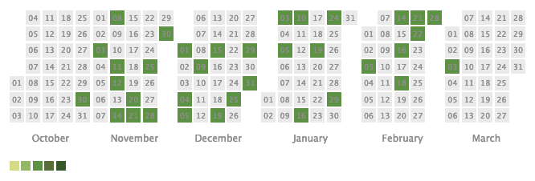

:ogp_title: Perlの力も使って聴かせるAIの声
:ogp_event_name: yapc_japan_online
:ogp_slide_name: ai_voice_python_and_perl
:ogp_description: 2022/03 YAPC::Japan::Online 2022 LT スライド

========================================
Perlの力も使って聴かせるAIの声
========================================

:Event: YAPC::Japan::Online 2022 LT
:Presented: 2022/03/05 nikkie

.. revealjs-break::
    :notitle:

にっきーと申します📛
========================================

* **Pythonチホー** から来ました🐍

  * PyCon JP 2021座長
  * データサイエンティスト at 株式会社ユーザベース

* アニメが好きです

.. revealjs-break::

* Pythonチホーから来ました🐍

  * PyCon JP 2021座長
  * データサイエンティスト at 株式会社ユーザベース

* **アニメが好き** です

.. _アイの歌声を聴かせて: https://ainouta.jp/

映画『`アイの歌声を聴かせて`_』🤖🎤🎼
========================================

.. raw:: html

    <iframe width="640" height="480" src="https://ainouta.jp/" title="アイの歌声を聴かせて 公式サイト"></iframe>

.. _第45回 日本アカデミー賞 優秀アニメーション作品賞: https://www.japan-academy-prize.jp/prizes/45.html#title02

`第45回 日本アカデミー賞 優秀アニメーション作品賞`_ 🏆
------------------------------------------------------------

* **アイの歌声を聴かせて**
* 漁港の肉子ちゃん
* 劇場版 呪術廻戦０
* シン・エヴァンゲリオン劇場版
* 竜とそばかすの姫

めちゃめちゃハマってます！😍😍😍
--------------------------------------------------

鑑賞回数、30回超え

AI シオン🤖🎤🎼
========================================

.. raw:: html

    <blockquote class="twitter-tweet" data-align="center" data-dnt="true">
／  サトミ！  私が幸せに  してあげる！  ＼    シオン（cv.<a href="https://twitter.com/hashtag/%E5%9C%9F%E5%B1%8B%E5%A4%AA%E9%B3%B3?src=hash&amp;ref_src=twsrc%5Etfw">#土屋太鳳</a> ）  ───────────  歌うの大好き！  ちょっとポンコツなAI🔌🎶    <a href="https://twitter.com/hashtag/%E3%82%A2%E3%82%A4%E3%81%86%E3%81%9F?src=hash&amp;ref_src=twsrc%5Etfw">#アイうた</a>🎬絶賛上映中！ <a href="https://t.co/Zxqr7SKpEY">pic.twitter.com/Zxqr7SKpEY</a>
&mdash; 映画『アイの歌声を聴かせて』 絶賛上映中！ (@ainouta_movie) <a href="https://twitter.com/ainouta_movie/status/1459355340886085634?ref_src=twsrc%5Etfw">November 13, 2021</a></blockquote> 

作ろう、シオン🛠
--------------------------------------------------

* アイうたが好き！　応援したい！
* 私にできるファン活動？
* 👉 **ITの力で再現実装**

小さく始める、作ろうシオン🛠
--------------------------------------------------

* 一部機能にフォーカス
* **音声対話** 機能
* （要は、Alexaみたいなものを作っています）

シオン v0.0.1を定義
========================================

1. 日本語を聞き取る
2. テキスト処理
3. 日本語を喋って返す

シオン v0.0.1をPython🐍で実装(中)
--------------------------------------------------

1. 日本語を **聞き取る** （ASR）
2. テキスト処理（オウム返し）
3. 日本語を **喋って** 返す（TTS）

シオン v0.0.1 powered by **Perl** 🐪
--------------------------------------------------

1. 日本語を聞き取る（ASR） 🐍
2. **テキスト処理**
3. 日本語を喋って返す（TTS） 🐍

🐪と🐍をシェルスクリプトで繋ぎます

シオン v0.0.1のテキスト処理 🐪
========================================

* **天気が訊ける** 機能 ☀️🌤⛅️☁️🌧
* 今回のYAPC Japan LT駆動で、Perlに入門🔰（Perl入学式を参照）

シオン v0.0.1のテキスト処理部分（Perlで実装）🐪🔰
--------------------------------------------------

聞き取ったテキストに

1. 「天気」を含んでいたら、東京の天気を取得（例：天気教えて）
2. 「天気」を含んでいなければ、オウム返し（例：カンファレンス楽しい）

Demo! AIの声を聴かせます
========================================

1. 「天気」を含まない例
2. 「天気」を含む例

※処理が遅いのは生暖かい目で見守ってください（愛すべきポンコツAIなのです）

**追記** デモ1実行時のログ（オウム返し）
--------------------------------------------------

.. code-block:: bash

    $ ./connect_services.sh
    start ASR by 🐍
    2022-03-05 18:21:09,895 - my_first_shion.asr - INFO - ASR model load: start
    2022-03-05 18:21:17,706 - my_first_shion.asr - INFO - ASR model load: end
    なにか話してください
    応答中...
    end ASR
    認識した文: カンファレンス楽しい

    start text processing by 🐪
    end text processing
    返答する文: カンファレンス楽しい

    start TTS by 🐍
    2022-03-05 18:21:27,100 - my_first_shion.tts - INFO - TTS model load: start
    2022-03-05 18:21:27,157 - my_first_shion.tts - INFO - TTS model load: end
    end TTS

**追記** デモ2実行時のログ（天気を取得して返す）
--------------------------------------------------

.. code-block:: bash

    $ ./connect_services.sh
    start ASR by 🐍
    2022-03-05 18:21:40,275 - my_first_shion.asr - INFO - ASR model load: start
    2022-03-05 18:21:46,475 - my_first_shion.asr - INFO - ASR model load: end
    なにか話してください
    応答中...
    end ASR
    認識した文: 天気を教えて

    start text processing by 🐪
    end text processing
    返答する文: 東京地方は、晴れています。

    start TTS by 🐍
    2022-03-05 18:21:53,976 - my_first_shion.tts - INFO - TTS model load: start
    2022-03-05 18:21:54,026 - my_first_shion.tts - INFO - TTS model load: end
    end TTS

LT駆動Perl入門の感想🔰
========================================

* **Perl入学式のテキスト最高！**　本当にありがとうございます！！❤️
* Linuxコマンドから始めて、Web APIの呼び出しまで **幅広く** カバー
* **日本語** で大きくハマらなかった（テキスト無しだとハマっていたはず）

シオン v0.0.1 powered by Perlの感想🤖
--------------------------------------------------

* 追加した機能：天気が訊ける
* 私「なんか違う🤔」
* （これはAlexaであって、シオンじゃないかも・・）

まとめ🌯：Perlの力も使って聴かせるAIの声
========================================

* 『アイの歌声を聴かせて』のAIシオンの **音声対話機能** を実装
* Pythonで音声を扱い、 **Perlでテキスト処理と分担** してみた
* **好き** なものをコードを書く題材にするの、とても楽しい😆

One more: 秘密はね、最後に明かされるんだよ
------------------------------------------------

* 本日15:30くらいに届いた **ピザ** 🍕
* 2021/10 PyCon JP ➡️ 2021/12 イベント振り返り ➡️ 2022/03 YAPC Japan
* 皆さんのピザのツイート見てとても嬉しかったです（関係者の皆さま、ありがとうございました）

ご清聴ありがとうございました
------------------------------------------------

* 運営スタッフの皆さま、LTの機会をありがとうございました❤️
* 『アイの歌声を聴かせて』、面白いからみんな観て！（配信始まります。続くAppendixへ）

Appendix：語り残したこと
========================================

* アイの歌声を聴かせてについて
* シオン v0.0.1実装について
* 自己紹介詳細版

アイの歌声を聴かせて
========================================

* 3/11から期間限定 **配信** ！！ https://ainouta.jp/ondemand.html
* 劇場で観たい方： `関東や関西、佐渡島で上映中 <https://eigakan.org/theaterpage/schedule.php?t=ainouta>`_ ！！

あのエンジニアからもオススメの声！
------------------------------------------------

.. raw:: html

    <blockquote class="twitter-tweet" data-align="center" data-dnt="true">
こにふぁーさんとも話したのですが「アイの歌声を聴かせて」、とにかく周囲のエンジニアの評判が高い。徹底したエンタメとしての面白さが突き抜けていますが、それに加えて「とにかく練られている」「全てが丁寧」「神が細部に宿る」的なプロの仕事としてみんな尊敬＆大好きな印象。
&mdash; GO (@go0517go) <a href="https://twitter.com/go0517go/status/1483463918563790849?ref_src=twsrc%5Etfw">January 18, 2022</a></blockquote>

.. revealjs-break::

.. raw:: html

    <blockquote class="twitter-tweet" data-align="center" data-dnt="true">
「アイの歌声を聴かせて」観てきた。 最高だった。最高レベルのSF作品だった。 「すぐ隣にいる近未来」っていう世界観だけでも大好きなのに、もうなんというか上手く言い表わせない。 とにかくテクノロジーが健気なんだ。俺が言いたいのはそれだけだ。  本当に素晴らしいのに上映数が少ないのが謎。
&mdash; ミノ駆動 (@MinoDriven) <a href="https://twitter.com/MinoDriven/status/1467453679179800576?ref_src=twsrc%5Etfw">December 5, 2021</a></blockquote>

全人類向け！ 面白いからみんな観て！
------------------------------------------------

.. raw:: html

    <iframe width="800" height="480" src="https://ftnext.github.io/2021_slides/ainouta/recommend_as_best.html"
        title="アイうたはいいぞ"></iframe>

シオン v0.0.1実装
========================================

* ブログで発信中
* `「シオン・プロジェクト」カテゴリ <https://nikkie-ftnext.hatenablog.com/archive/category/%E3%82%B7%E3%82%AA%E3%83%B3%E3%83%BB%E3%83%97%E3%83%AD%E3%82%B8%E3%82%A7%E3%82%AF%E3%83%88>`_

音声の聞き取り・喋る仕組み
------------------------------------------------

どちらも **公開されている機械学習のモデル** を読み込んで実現しています

音声の聞き取り（ASR）
------------------------------------------------

* 音声認識 Automatic speech recognition）
* 声をPythonに聴かせて

  * `前編 <https://nikkie-ftnext.hatenablog.com/entry/my-first-shion-python-speech-recognition-part1>`_
  * `後編 <https://nikkie-ftnext.hatenablog.com/entry/my-first-shion-python-speech-recognition-part2>`_

喋る（TTS）
------------------------------------------------

* 音声合成 Text-To-Speech
* `Pythonの読み上げを聴かせて <https://nikkie-ftnext.hatenablog.com/entry/my-first-shion-python-text-to-speech>`_

ソースコード
------------------------------------------------

* 今年に入ってから、プライベートリポジトリで開発してきました
* そろそろアルファ版として公開します💪

お前、誰よ（自己紹介詳細版）
========================================

* Python大好き **にっきー**

  * Twitter `@ftnext <https://twitter.com/ftnext>`__
  * GitHub `@ftnext <https://github.com/ftnext>`__

* Python歴4年。株式会社ユーザベースのデータサイエンティスト（NLPer）

.. revealjs-break::

* **Py** thon **Con** ference JP スタッフ 2019年から（2022は未定）
* 2021年は座長（＝開催に責任を持つ人）
* `技術で(も)支えたPyCon JP 2021 <https://nikkie-ftnext.hatenablog.com/entry/pyconjp2021-portfolio>`_

EOF
==============================
